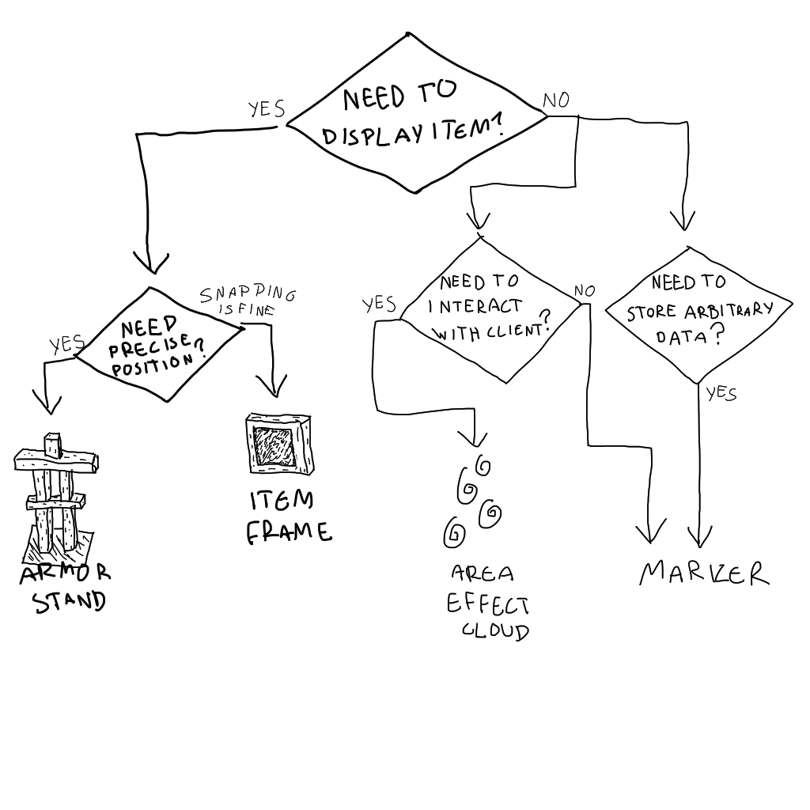

# Marker Entities
There are many types of entity that you can use as a marker entity. Literally every mob can be a marker.
Here I will outline a couple of them and their advantages and disadvantages

### Marker Entity
- The best marker there is
- Least laggy, best for performance
- Most versatile
- No hitbox
- Cannot render anything

### Armor Stand
- Able to render up to 3 custom model in one entity
- Wider render range
- Freedom of rotation

### Item Frame/Glowing Item Frame
- Able to render model in one entity
- Allow directional placement in one item that also summons the entity
- Block detection, e.g. won't place in slab and will place in grass
- Always lit when using glowing item frame
- Less degrees of freedom for rotation

### Area Effect Cloud
- Self-included timer
- No hitbox
- No real reason to use this other than to give area effect
- The worst marker there is

A quick diagram to choose which marker is the best for you, by Ellivers:

